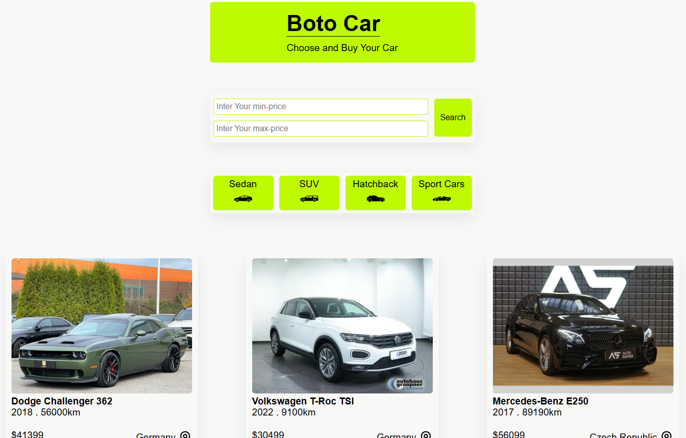

# Car Marketplace Website

A modern **car marketplace website** built with **Next.js** where users can browse, search, and filter cars for buying and selling.  
The platform allows filtering cars by **price range** and selecting from different **categories** such as **Sedan**, **SUV**, **Sport**, and **Hatchback**.

---

## 🚀 Features
- 🔎 Search bar to quickly find cars  
- 🏷️ Filter cars by **price range**  
- 🚘 Category filtering (Sedan, SUV, Sport, Hatchback)  
- 📄 Car listing page with dynamic data  
- 📱 Responsive design for mobile and desktop  
- ♻️ Reusable and modular React components  

---

## 🛠️ Technologies
- [Next.js](https://nextjs.org/) – React framework  
- [React](https://react.dev/) – UI library  
- CSS Modules – styling  
- JavaScript (ES6+)